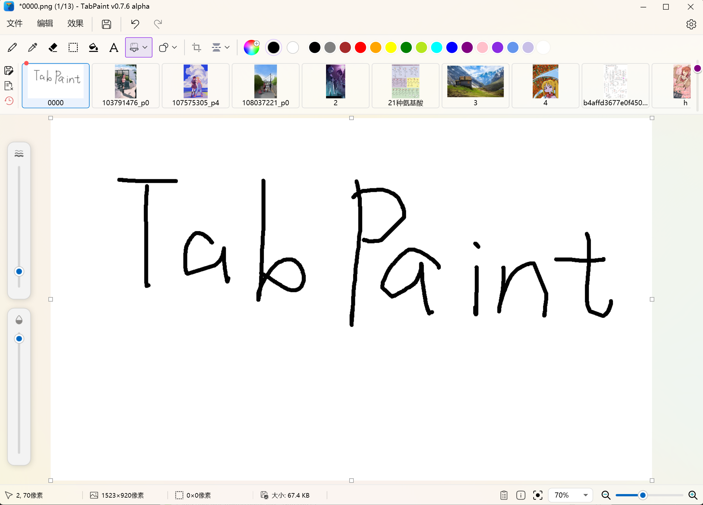

# 🎨 TabPaint (Alpha)

   

> **English** | [中文](#chinese)

---

## 🇬🇧 English Introduction

**TabPaint** is a lightweight image editor and viewer tailored for Windows 10/11, built with C#, WPF (.NET), and Win32 APIs (Mica/DWM).

It fits perfectly into the **"10-second edit" workflow**: ideal for when you need to screenshot, annotate, crop, and paste into a document instantly. It bridges the gap between a simple image viewer and an editor, combining the familiarity of MS Paint with **browser-style tabs** and seamless drag-and-drop integration.

### 🚧 Alpha Warning (v0.7.6)
**Current Status: Active Development**
This software is in **Alpha Testing**. 
*   ⚠️ **Stability**: While many bugs have been fixed in v0.7.6, edge cases with large images or complex undo operations may still exist.
*   **Recommendation**: Perfect for quick screenshots and annotations. Please save your work frequently!

### ✨ Key Features (v0.7.x)
*   **Multi-Tab Interface (ImageBar)**: 
    *   **Browser-like experience**: `Ctrl+W` to close, `Ctrl+Shift+V` to paste as new tab.
    *   **Notepad++ Mode**: Keep multiple images open; unsaved edits are cached.
    *   **Drag & Drop**: Drag files to open; drag selections out to create files directly.
*   **Powerful Tools**: 
    *   **Drawing**: Pencil, Brush, Shapes (Circle/Rect/Line/Arrow), Eraser.
    *   **Text Tool**: Rich text support with alignment, strikethrough, and background fill.
    *   **Editing**: Crop, Resize (8-point handles), Rotate (`Ctrl+L/R`), Flip.
    *   **Colors**: Custom color palette, Opacity/Alpha channel support, HSV/RGB adjustments.
*   **Modern UI & UX**: 
    *   **Win11 Style**: Borderless window with Mica effect.
    *   **Fluent UI**: Modern icons and controls.
    *   **Info Bar**: Real-time display of dimensions, file size, and zoom level.

### 🗺️ Roadmap

| Feature | Status | Note |
| :--- | :---: | :--- |
| **Multi-Tab System** | ✅ | Stable. Supports reordering and file operations. |
| **Advanced Text Tool** | ✅ | Added alignment, background fill in v0.7.4. |
| **Transformations** | ✅ | Rotate, Flip, Crop fully implemented. |
| **Transparency** | 🔨 | **In Progress**: Alpha channel drawing support. |
| **Viewer Mode** | 📅 | **Target for v0.8**: Separate immersive "View Mode". |
| **Gif Support** | 📅 | **Target for v0.8**: Playback support. |
| **High DPI Support** | 🐛 | Optimizing selection borders for >100% scaling. |

---

## 🇨🇳 中文介绍

**TabPaint** 是一款基于 C# WPF 和 Win32 API 开发的现代化 Windows 图片编辑与查看工具，采用 Win11 风格的无边框 Mica 特效窗口。

它的定位介于“看图软件”和“专业绘图软件”之间，专为 **“10秒内快速修图”** 场景设计：截图 -> 标注 -> 裁剪 -> 拖拽发送。拥有类似 Notepad++ 的多标签页共存模式和强大的剪贴板交互能力。

### 🚧 Alpha 版本预警 (v0.7.6)
**当前状态：活跃开发中**
本项目目前处于 **Alpha 内测阶段**。
*   ⚠️ **稳定性**：v0.7.6 修复了大量关于旋转、裁剪和内存管理的 Bug，但某些极端操作下仍可能不稳定。
*   **建议**：适合日常截图标注和轻量修图，建议养成随手保存的习惯。

### ✨ 核心功能 (v0.7.x)
*   **多标签页系统 (ImageBar)**：
    *   **高效管理**：支持拖拽排序、`Ctrl+W` 关闭、中键关闭。
    *   **智能粘贴**：`Ctrl+Shift+V` 极速粘贴为新标签页；剪贴板监听功能。
    *   **文件流**：支持多文件拖入打开；支持将选区直接拖出生成文件或拖入 Word。
*   **全面绘图工具**：
    *   **画笔与形状**：铅笔、笔刷、直线、箭头、矩形、圆形等，支持调节粗细与不透明度。
    *   **增强文字工具**：支持左/中/右对齐、删除线、背景填充及字体选择。
    *   **图像调整**：亮度、对比度、饱和度、色调滤镜；8向手柄调整画布大小。
    *   **变换操作**：任意角度旋转、`Ctrl+L/R` 快捷旋转、水平/垂直翻转。
*   **现代交互体验**：
    *   **Mica 特效**：原生 Win11 云母材质背景。
    *   **Fluent UI**：美化的滑动条、按钮及颜色选择器。
    *   **详细信息**：底部栏实时显示图片尺寸、文件大小及缩放比例。

### 🗺️ 开发计划

| 功能特性 | 状态 | 说明 |
| :--- | :---: | :--- |
| **多标签页支持** | ✅ | v0.7.x 已完善排序、缓存与恢复逻辑。 |
| **高级文字工具** | ✅ | v0.7.4 实装对齐与样式支持。 |
| **旋转与变换** | ✅ | 支持旋转、裁剪、调整画布。 |
| **透明度支持** | 🔨 | **进行中**：颜色编辑器支持 Alpha 通道，界面显示优化。 |
| **看图模式** | 📅 | **v0.8 目标**：看图/画图模式分离，沉浸式看图，支持 GIF。 |
| **性能优化** | 📅 | **持续进行**：大图加载、内存回收及笔刷算法优化。 |

### 📜 最近更新 (Changelog)

<b>v0.7.6 (Latest)</b>

*   **修复**：全屏模式下拖拽标题栏无法恢复窗口大小的问题。
*   **修复**：旋转裁剪后缩略图更新滞后的问题。
*   **优化**：Selection 工具拖拽手柄逻辑重构。
*   **优化**：大幅改进 ImageBar 拖拽手感（动画效果优化）。
*   **功能**：Opacity Bar 拖拽时实时显示透明度数值。
*   **功能**：新增 `Ctrl+L` / `Ctrl+R` 快捷键旋转图片。
*   **修复**：运行时删除缓存文件导致的退出崩溃问题。

点击展开 v0.7.3 - v0.7.5 更新日志

**v0.7.5**
*   **UI 美化**：全面 Fluent UI 化，重绘 ColorWheel，优化 Slider 样式。
*   **新增**：画笔不透明度 (Opacity) 调节支持。
*   **新增**：Mica (云母) 窗口特效。
*   **修复**：TextTool 生成半透明区域的 Bug。
*   **修复**：ZoomSlider 非线性滑动体验优化。

**v0.7.4**
*   **新增**：Text 工具支持对齐（左/中/右）、删除线及背景填充。
*   **新增**：底部栏显示文件体积。
*   **修复**：旋转图片后出现透明图层的 Bug。
*   **修复**：Shape 工具双重撤销及无法拖拽大小的问题。
*   **优化**：笔刷粗细调节改为非线性，更易控制。

**v0.7.3**
*   **重构**：MainWindow 拆分为多个 UserControl，提升代码可维护性。
*   **新增**：F11 全屏/还原模式。
*   **新增**：自定义颜色编辑界面（Fluent 风格）。
*   **优化**：画笔算法优化，减少低像素下的毛刺感。

### 🐛 已知问题
*   **超大图支持**：16k+ 分辨率图片可能会触发内存警告，或导致选区工具轻微卡顿。
*   **高分屏适配**：在非 100% 缩放比例下，部分选区边框可能存在像素级错位。
*   **Gif 支持**：目前仅支持静态显示，动态播放将在 v0.8 中加入。

---

### 📥 Download / 下载
Please check the [Releases](../../releases) page for the latest build.
请前往 [Releases](../../releases) 页面下载最新构建版本。
