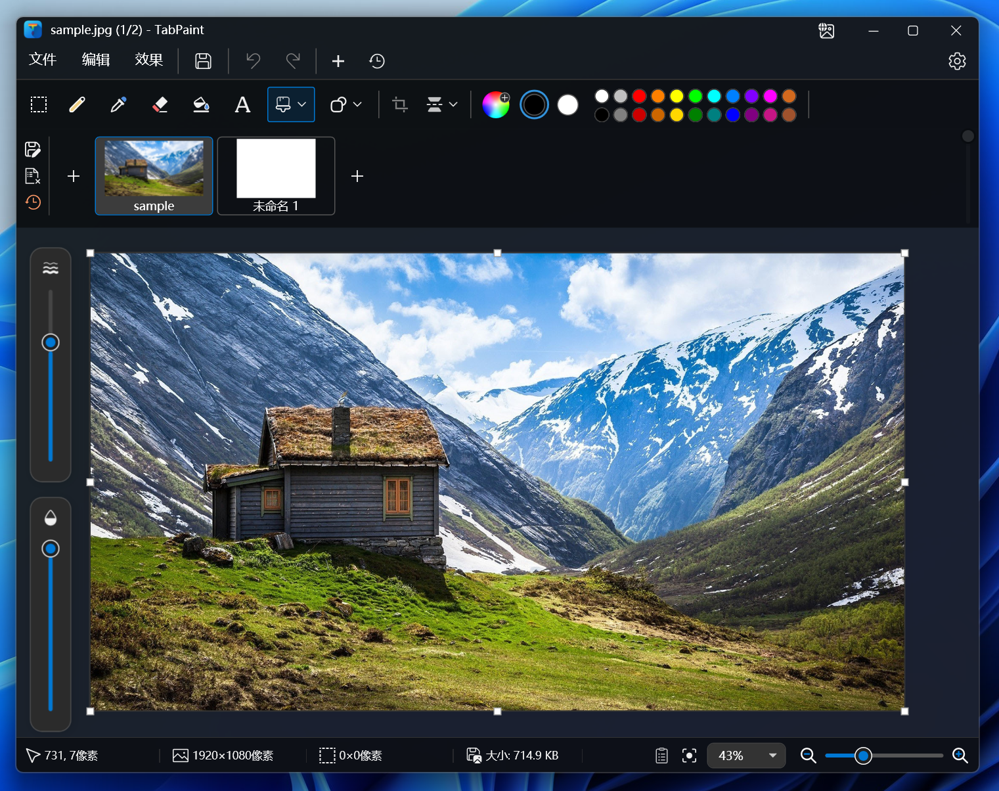
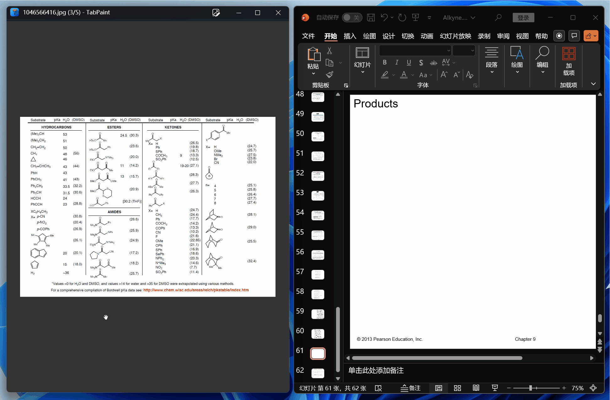

  <table>
    <tr>
      <td align="center" style="border: none;">
        
      </td>
      <td align="left" style="border: none; vertical-align: middle;">
        <h1 style="margin: 0; font-size: 48px;">Tab Paint</h1>
        
<b>Windows 上的“图片版 Notepad++”</b>

      </td>
    </tr>
  </table>

  

    多标签页管理 · 看图画图双模式 · AI 智能辅助 · 无缝拖拽操作
  

  <!-- Badges -->
  
  
  
  

  <strong>简体中文</strong> | <a href="./README.EN.md">English</a>

---

## ✨ 核心特性 (Features)

### · 🖼️ 看图画图双模式 (Dual Mode)
*   **看图模式**：极简界面，沉浸式浏览，支持滚轮缩放、GIF 播放。
*   **画图模式**：按下 **`Tab`** 键，工具栏即刻弹出，无缝切换进入编辑状态。

### · 📑 像管理代码一样管理图片
支持多标签页（Multi-Tab）共存, 同时打开十几张截图，通过 ImageBar 快速切换、对比、批量处理。

### · 🤖 AI 赋能的现代工具箱
*   **AI 一键抠图**：集成 ONNX 模型，本地离线快速抠除背景。
*   **OCR 文字识别**：截图提取文字，不再需要额外工具。
*   **智能辅助**：屏幕取色器、智能裁切空白、一键加边框。

### · 🖱️ 无缝拖拽
*   **剪贴板监听**：截图后自动弹出提示，Ctrl+V 粘贴为新标签页。
*   **全方位拖拽功能支持**：
    *   拖拽图片文件或网页图片 -> 插入画板
    *   拖拽 ImageBar 缩略图 -> 生成文件到桌面/ 插入 Word / 发送给 QQ 微信
    *   拖拽选区 -> 直接插入 PPT 或文档
    *   ......

---

## ⌨️ 常用快捷键 (Shortcuts)

Tab Paint 提供多种快捷键：

| 快捷键 | 功能描述 |
| :--- | :--- |
| **`Tab`** | **一键切换 看图 / 画图 模式** |
| `Ctrl` + `N` | 新建画布 / 从剪贴板新建 |
| `Ctrl` + `W` | 关闭当前标签页 |
| `Ctrl` + `S` | 保存 (覆盖原图) |
| `Ctrl` + `L` / `R` | 向左 / 向右 旋转图片 |
| `Space` + 拖动 | 抓手工具 (移动画布) |
| `Del` | 删除文件至回收站 (可撤销，需在设置开启) |
| `Ctrl` + `Wheel` | 缩放画布 |

---

## 📥 下载与安装 (Download)

### 系统要求
*   **操作系统**: Windows 10 或 Windows 11
*   **运行环境**: .NET 8.0 Desktop Runtime 或更高版本 (如未安装会自动提示)

### 获取方式
1.  **Github Releases (推荐)**: [点击前往下载最新版](https://github.com/zouxiaofei1/TabPaint/releases)
    *   `TabPaint_Setup_Full.exe`: 完整包，自带运行库
    *   `TabPaint_Setup_Lite.exe`: 联网下载运行库(微软源)
    *   `Portable.zip`: 便携版
2.  网盘链接

---

## ❓ 常见问题 (FAQ)

**Q: 启动速度比起 Honeyview/系统看图好像慢一点？**
A: Tab Paint 采用 WPF 技术构建，初始化需要加载更多资源。但在启动后，Tab 切换和图片切换是毫秒级的。我们的理念是：**用 0.2秒 的启动延迟，换取后续 10分钟 无需切换软件的流畅体验。**

**Q: AI 功能需要联网吗？**
A: 不需要。AI 抠图功能基于本地 ONNX 运行时，联网仅用于下载运行库

**Q: 支持哪些图片格式？**
A: 支持 JPG, PNG, BMP, WEBP, ICO, GIF (查看与播放), HEIC, TIF 等主流格式。

---

## 📄 版权与联系 (License & Contact)

本项目采用 **MIT License** 开源。
使用了以下依赖：`MicaWPF`, `SkiaSharp`, `XamlAnimatedGif`, `OnnxRuntime`, `WriteableBitmapEx`

*   **反馈与建议**: 请提交 [Issues](https://github.com/zouxiaofei1/TabPaint/issues) 或发送邮件至 `zouxiaofei1@gmail.com`

